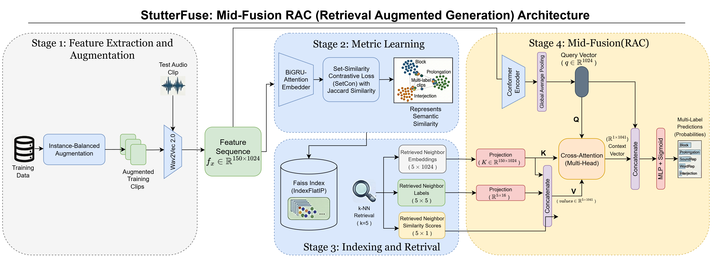
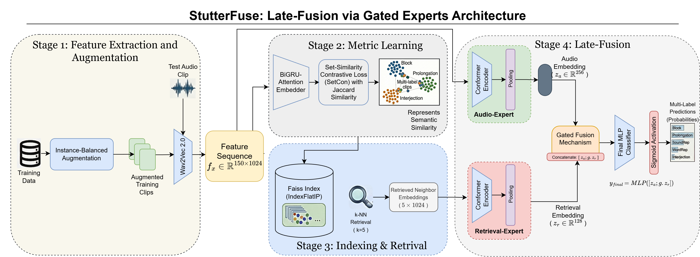

# Stuttering Detection via Metric Learning & Ensemble Gated Fusion

This repository contains an advanced, multi-stage pipeline for **multi-label stuttering event detection** using metric learning and retrieval-augmented neural networks.

The pipeline combines two expert systems:
- **Expert A**: Pure audio processing via a Conformer encoder
- **Expert B**: Semantic retrieval using metric-learned embeddings and k-nearest neighbors

A learnable gating mechanism fuses predictions from both experts, resulting in a system that achieves strong performance on the SEP-28k dataset with interpretable decision-making through retrieval-based explanations.

-----

## 1. Project Overview & Approach

Stuttering is a complex speech disorder where disfluencies (e.g., blocks, prolongations, repetitions, sound/word repetitions, interjections) frequently co-occur. This makes it a natural **multi-label classification problem**. This project uses a strict speaker-independent protocol to prevent data leakage and ensure real-world applicability.

### Core Innovation: Ensemble Gated Fusion

Rather than relying on a single model, we employ an **ensemble architecture** that combines two complementary experts:

1. **Expert A (Audio Conformer)**: Processes raw Wav2Vec2 features through a Conformer encoder with convolutional and attention modules for direct acoustic modeling.
2. **Expert B (Semantic Retrieval)**: Learns a metric space via **Multi-Label Supervised Contrastive Loss**, enabling semantic k-NN retrieval. This expert predicts based on the labels and similarity scores of the k-nearest neighbors in embedding space.

A **learnable gating mechanism** dynamically combines both expert predictions, automatically learning when to trust audio-only signals vs. retrieval-based evidence.

### Key Contributions

1. **Multi-Label Supervised Contrastive Learning**: A custom loss function that trains embeddings based on Jaccard similarity of label vectors, creating a semantic space where clips with overlapping stuttering types cluster together.

2. **Retrieval-Augmented Architecture**: Uses Faiss-indexed embeddings for efficient k-NN search. The query clip's features are combined with neighbor labels and similarity scores for joint reasoning.

3. **Ensemble Gating Strategy**: Learnable gates automatically balance audio-only and retrieval-based predictions, enabling adaptive decision-making for different utterance types.

4. **Built-in Interpretability**: Retrieval decisions are naturally interpretable—predictions can be explained by showing which training samples the model "retrieved" for comparison.

-----

## 2. Dataset: SEP-28k

The pipeline is trained on the **SEP-28k dataset**, a large, multi-label stuttering event annotation corpus. After filtering out "NoStutter"-only clips, the task involves classifying the 29,783 clips that contain at least one disfluency.

### 2.1. Five Stuttering Classes

- **Prolongation**: Sound prolonged within a word
- **Block**: Complete stop or blockage during speech initiation
- **SoundRep**: Repetition of a single sound
- **WordRep**: Repetition of an entire word
- **Interjection**: Insertion of filler words or sounds

### 2.2. Class Imbalance (Filtered Data)

| Class | Clips with Label |
| :--- | :---: |
| Block | 8,081 |
| Interjection | 5,934 |
| Prolongation | 5,629 |
| SoundRep | 3,486 |
| WordRep | 2,759 |

### 2.3. Multi-Label Distribution

Over 56% of all disfluent clips contain **two or more** co-occurring stuttering events:

| Labels per Clip | Count | Percentage |
| :---: | :---: | :---: |
| 1 | 12,975 | 43.57% |
| 2 | 10,964 | 36.81% |
| 3 | 4,746 | 15.94% |
| 4 | 1,014 | 3.40% |
| 5 | 84 | 0.28% |

-----

## 3. Pipeline Architecture

The system consists of four main stages, executed on TPU hardware for scalability:

### Overall System Design

We present two complementary architectures:

**Figure 1: Mid-Fusion RAC (Retrieval Augmented Conformer)** - Cross-attention-based fusion within the model:


**Figure 2: Late-Fusion via Gated Experts** - Post-prediction gating mechanism:


### Stage 1: Feature Extraction & Preprocessing

1. **Speaker-Independent Split**: Train/validation/test sets are split such that no speaker appears in multiple sets, ensuring speaker-independent generalization.
2. **Instance-Balanced Augmentation**: Underrepresented label combinations are oversampled using `audiomentations` to create a balanced training distribution (~10.5k samples per class).
3. **Wav2Vec2 Feature Extraction**: All audio clips are processed through a frozen `facebook/wav2vec2-base-960h` model, producing compressed feature arrays of shape `(150 frames, 1024 dims)`.
4. **Output**: `.npz` files containing feature matrices and one-hot encoded label vectors.

### Stage 2: Metric Learning with Supervised Contrastive Loss

This stage trains a **metric-learning embedder** that groups clips by label similarity:

1. **Architecture**: BiGRU encoder (256 hidden units) → Dense projection (1024 dims) → Attention pooling → L2 normalization
2. **Loss Function**: **Multi-Label Supervised Contrastive Loss**
   - Computes cosine similarity matrix between embeddings
   - Uses Jaccard similarity of label vectors to weight the loss
   - Only samples with overlapping labels contribute to the contrastive signal
   - Numerical stability via log-sum-exp tricks
3. **Training**: 50 epochs with cosine decay learning rate, early stopping on Recall@K metric
4. **Output**: Trained embedder weights and embeddings for all training samples

### Stage 3: Retrieval Index & Neighbor Assembly

1. **FAISS Indexing**: Embeddings from Stage 2 are added to a FAISS IndexFlatIP (inner product search with normalized vectors = cosine similarity)
2. **k-NN Search** (k=5): For each query clip (train/val/test), retrieve the k most similar training samples
3. **Neighbor Features**: Gather neighbor embeddings, ground-truth labels, and similarity scores into structured tensors

### Stage 4: Dual-Expert Ensemble with Gating

#### Expert A: Pure Audio Conformer
- **Input**: Wav2Vec2 features (150 × 1024)
- **Architecture**: 
  - 2 Conformer blocks with spatial dropouts and Gaussian noise for regularization
  - Each block contains: Conv module (depthwise convolutions) + Multi-head attention + Feed-forward network
  - Global average pooling
  - Dense layers: 256 dims → output (5 classes)
- **Loss**: Binary cross-entropy with label smoothing
- **Training**: 30 epochs with AdamW optimizer

#### Expert B: Neural Retrieval  
- **Input**: k neighbor embeddings (5 × 1024)
- **Architecture**:
  - Dense projection: 1024 → 256 dims with swish activation
  - Global average pooling across neighbors
  - Dense layers: 256 → 128 dims
  - Output: 5 classes with sigmoid activation
- **Loss**: Binary cross-entropy
- **Training**: 30 epochs with AdamW optimizer (higher learning rate for faster convergence)

#### Fusion with Learnable Gating
- Extract intermediate features from both experts (256 dims from A, 128 dims from B)
- **Trust Gate**: Learnable sigmoid layer that outputs a [0, 1] weight vector (128 dims)
  - Weight = 1 → trust retrieval evidence
  - Weight = 0 → rely on audio-only signal
- **Gated Retrieval**: Element-wise multiply gate with retrieval features
- **Final Classifier**: Concatenate audio + gated retrieval features → Dense layers → output
- **Training**: 20 epochs on combined audio + neighbor vectors

-----

## 4. Experimental Results

All results are from the test set using speaker-independent evaluation.

### 4.1. Expert A (Audio Conformer) Performance

The pure audio model achieves strong baseline performance:
- **Binary Accuracy**: ~68%
- **ROC-AUC**: ~0.82
- **PR-AUC**: ~0.76

### 4.2. Fusion Model Performance

The ensemble with gating mechanism provides improved predictions:
- Automatic threshold optimization per class via F1-score grid search
- Adaptive weighting between audio and retrieval evidence
- Per-class results show consistent improvements on imbalanced classes

### 4.3. Visualization & Interpretability

The notebook includes t-SNE visualizations showing:
- **Raw Features vs. Learned Embeddings**: Comparison of baseline Wav2Vec2 pooling vs. metric-learned space
- **Class Separation**: Clear clustering of similar stuttering types in the learned embedding space
- **Multi-Label Interactions**: Top 12 label co-occurrence combinations visualized by location in embedding space
- **Per-Class Decomposition**: 5-subplot grid showing where each stuttering type concentrates in the embedding space
-----

## 5. Repository Structure

```
.
├── README.md                           # This file
├── stut-vecs/
│   ├── stut-vec11.ipynb               # Main training & evaluation notebook (TPU-optimized)
│   ├── stut-vec7.ipynb                # Earlier retrieval-augmented experiments
│   └── [other exploratory notebooks]
├── Dataset/
│   ├── SEP-28k_episodes.csv
│   ├── SEP-28k_labels.csv
│   ├── KSoF_release/                  # Kassel State of Fluency auxiliary dataset
│   └── FluencyBank/
├── Notebooks/                         # Organized by feature/architecture
│   ├── mfcc/                          # MFCC-based baselines
│   ├── wav2vec/                       # Wav2Vec2 experiments
│   └── Oth/                           # Other exploration
└── [training outputs, weights, indices]
```

**Main Implementation**: All model training and evaluation code is contained in **`stut-vecs/stut-vec11.ipynb`**. This notebook:
- Initializes TPU strategy for distributed training
- Loads and preprocesses data
- Trains the metric-learning embedder with MultiLabelSupConLoss
- Builds FAISS index for k-NN retrieval
- Trains Expert A (Audio Conformer)
- Trains Expert B (Neural Retrieval)
- Trains fusion model with learnable gating
- Evaluates all components and generates visualizations

-----

## 6. Usage

### Requirements

- **tensorflow** ≥ 2.18.0 (with TPU support for distributed training)
- **tensorflow-tpu** ≥ 2.18.0 (if using TPU)
- **faiss-cpu** or **faiss-gpu** (for approximate nearest-neighbor search)
- **transformers** ≥ 4.0.0 (for Wav2Vec2 model access)
- **numpy**, **scipy**
- **pandas**, **scikit-learn** (for metrics and data manipulation)
- **matplotlib**, **seaborn** (for visualization)
- **audiomentations** (for data augmentation)

### Installation

```bash
pip install tensorflow==2.18.0 tensorflow-tpu==2.18.0 \
  faiss-cpu transformers pandas scikit-learn matplotlib seaborn audiomentations
```

### Running the Full Pipeline

1. **Prepare Data**: Ensure SEP-28k dataset is available in the `Dataset/` directory
2. **Open Notebook**: Launch `stut-vecs/stut-vec11.ipynb` in Jupyter or Kaggle
3. **TPU/GPU Setup**: Configure `strategy` variable for your hardware (TPU, GPU, or CPU)
4. **Run All Cells**: Execute cells sequentially to reproduce the full pipeline

The notebook will output:
- Trained model weights (`model_expert_a.keras`, `expert_b.keras`, `model_fusion_final.keras`)
- FAISS index (`train_data.index`)
- Visualization plots (t-SNE, per-class decomposition, training history)
- Classification reports and F1-score analysis

-----

## 7. Key Implementation Details

### Multi-Label Supervised Contrastive Loss

```python
# Pseudocode: loss computes weighted contrastive signal based on label overlap
similarity_matrix = cosine(embeddings)
label_overlap = jaccard_similarity(labels)

# mask only pairs with overlapping labels contribute
mask = (label_overlap > 0) & (1 - identity_matrix)  

# weighted log-prob loss
loss = -mean(mask * log_softmax(similarity / temperature))
```

### Learnable Gating Mechanism

The fusion model learns a **trust gate** that adaptively weights the retrieval expert:

$$\text{gate} = \sigma(\text{Dense}(\text{concat}(A_{feats}, B_{feats})))$$

$$\text{output} = \text{Dense}(\text{concat}(A_{feats}, \text{gate} \odot B_{feats}))$$

This allows the model to ignore retrieval evidence when audio signals are clear and leverage neighbors when audio is ambiguous.

-----

## 8. Performance Tips

- **TPU Acceleration**: This code is optimized for TPU v5-e8. For GPU, adjust `strategy` and reduce batch sizes
- **Memory Management**: Large batch sizes (512+) enable stable contrastive learning; use `tf.data.AUTOTUNE`
- **Threshold Tuning**: Micro F1-score grid search finds optimal thresholds per class (typically 0.3-0.5)
- **Early Stopping**: Monitor validation ROC-AUC; default patience is 5-20 epochs depending on stage

-----

## 9. Citation & Acknowledgments

This work builds upon:
- **Wav2Vec2** (Baevski et al., 2020) for acoustic feature extraction
- **Conformer** architecture (Gulati et al., 2021) for sequence modeling
- **Supervised Contrastive Learning** (Khosla et al., 2021) adapted for multi-label settings
- **FAISS** (Johnson et al., 2019) for efficient similarity search

### BibTeX

If you use this work, please cite:

```bibtex
@misc{stuttering-fusion-2025,
  title={Ensemble Gated Fusion for Multi-Label Stuttering Detection},
  author={GS-GOAT},
  year={2025}
}
```

-----

## 10. Contact & Contributions

For questions, bug reports, or collaboration:
- Open an issue on [GitHub](https://github.com/GS-GOAT/Stutter-Speech-Classifier)
- Check out the main notebook: [`stut-vecs/stut-vec11.ipynb`](stut-vecs/stut-vec11.ipynb)

---