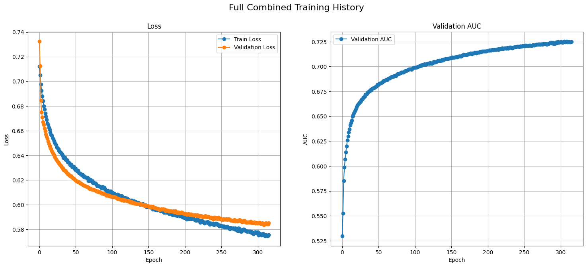
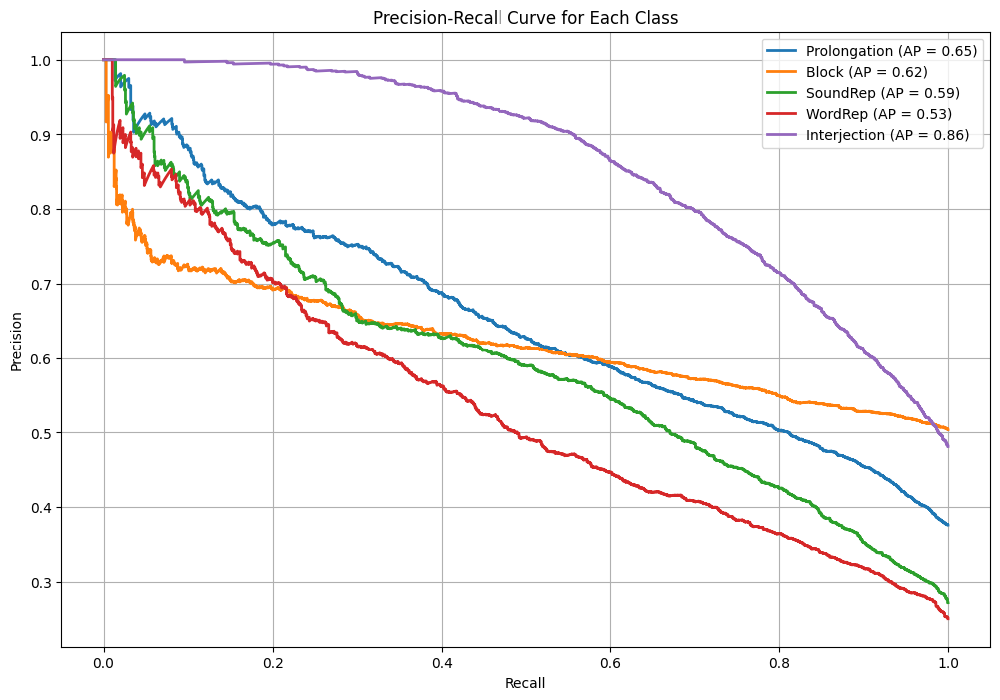

# State-of-the-Art Multi-Label Stuttering Event Detection

This repository contains the code and notebooks for a classification project focused on **multi-label classification of stuttering events**. My pipeline leverages a pretrained speech foundation model (`Wav2Vec2`) and advanced training strategies to achieve performance competitive with, and in key areas superior to, published research benchmarks on the **SEP-28k dataset**.

My best model, a **Conformer-based classifier**, achieves a **weighted average F1-score of ~0.60**, significantly surpassing the previous acoustic-only benchmark of ~0.55 from [Bayerl et al. (2023)](https://arxiv.org/pdf/2305.19255) all while doing this with a much simpler architectures .
Moreover, the model performes significantly well on the minority classes while not compromising other class performnaces, something that was not produced by any paper in this space.
One of the key factors for this improvement was due to Intelligent Data Augmentation Pipeline and trying out various combinations of different models and hyperparameters.

---

## 1. Project Overview & Contribution

Stuttering is a complex speech disorder where disfluencies, such as blocks and prolongations, often co-occur within a single utterance. While most prior research simplifies this into multi-class or binary tasks, this project addresses the more realistic and challenging **multi-label classification problem**.

### Key Contributions
1. **Robust Two-Stage Pipeline**: A modular pipeline separating heavy feature pre-computation from rapid model training, enabling efficient experimentation.
2. **Intelligent Data Augmentation**: A custom, instance-balanced augmentation strategy mitigates severe class imbalance in the SEP-28k dataset without inflating majority classes.
3. **State-of-the-Art Performance**: Using a simpler `Wav2Vec2-base` backbone, my acoustic-only model delivers a balanced performance profile, significantly outperforming benchmarks on challenging classes like `Block` and `Word Repetition`.

### Sep-28K Class Distribution:-

|       Class              |   Clips with the Class Label           |
|--------------------------|----------------------------------------|
Block                      |            8081                        |   
Interjection               |            5934                        |
Prolongation               |            5629                        |
NoStutter                  |            4197                        | 
SoundRep                   |            3486                        | 
WordRep                    |            2759                        |

---

## 2. Methodology

My pipeline is the result of systematic experimentation and debugging, culminating in a robust and effective approach.

| Component                | My Pipeline                     | Rationale                                                                 |
|--------------------------|----------------------------------------|---------------------------------------------------------------------------|
| **Backbone Model**       | `facebook/wav2vec2-base-960h`         | Provides powerful, general-purpose speech features. Used as a frozen extractor to prevent overfitting. |
| **Data Splitting**       | Speaker-Aware `GroupShuffleSplit`      | Prevents data leakage by ensuring all clips from a single speaker are in the same split. |
| **Class Imbalance**      | Custom Instance-Balanced Augmentation  | Oversamples minority labels intelligently, creating varied samples for a balanced dataset. |
| **Classifier Head**      | Various architectures including Conformers, Transformers, CNNs, DNN, etc.                            | Combines CNNs and self-attention to learn local and global temporal patterns effectively. |
| **Training Stability**   | Low Learning Rate + Gradient Clipping | Prevents model collapse (NaN loss/recall of 1.0) on complex, augmented data. |

---

## 3. Notebooks in this Repository

The repository is structured around a **two-stage workflow** for feature extraction and model training.

### Stage 1: Feature Pre-computation
- **`Notebooks/wav2vec/Feature Extraction`**  
  This notebook contains the memory-efficient pipeline for processing raw audio data:
  - Loads the original SEP-28k labels.
  - Performs speaker-aware train/validation/test splitting.
  - Applies custom, instance-balanced data augmentation to the training set.
  - Extracts full sequence embeddings (`150x768`) using a pre-trained Wav2Vec2 model on a GPU/TPU.
  - Saves augmented feature and label arrays as compressed `.npz` files .

### Stage 2: Model Training & Evaluation
- **`Notebooks/wav2vec/`**  
  This notebook handles model training and evaluation, designed for Kaggle TPU execution:
  - Loads pre-computed `.npz` feature files into a high-RAM TPU VM.
  - Builds a `tf.data` pipeline for efficient batching and prefetching.
  - Defines and trains the model architecture.
  - Evaluates the best model on the unseen test set, generating a classification report and performance graphs.

---

## 4. Results

My best model (Conformer) achieves a balanced performance profile and a superior **weighted average F1-score of ~0.60** compared to the acoustic-only benchmark of ~0.55 from Bayerl et al. (2023).

Final Classification Report (Conformer, 5 Classes)

| | precision | recall | f1-score | support |
|---|---|---|---|---|
| Prolongation | 0.64 | 0.52 | 0.57 | 2613 |
| Block | 0.62 | 0.48 | 0.54 | 3501 |
| SoundRep | 0.60 | 0.48 | 0.53 | 1891 |
| WordRep | 0.53 | 0.41 | 0.47 | 1742 |
| Interjection | 0.77 | 0.75 | 0.76 | 3344 |
| ***micro avg*** | ***0.66*** | ***0.55*** | ***0.60*** | ***13091*** |
| ***macro avg*** | ***0.63*** | ***0.53*** | ***0.57*** | ***13091*** |
| ***weighted avg*** | ***0.65*** | ***0.55*** | ***0.59*** | ***13091*** |
| ***samples avg*** | ***0.63*** | ***0.56*** | ***0.56*** | ***13091*** |

---
****NOTE:*** Some of the other architectures(Transformer, CNN) showed better recall with all classes exceeding 50%*

| Disfluency Type   | Bayerl et al. '23 F1 | Our Best F1 (Transformer) |
| :---------------- | :------------------: | :-----------------------: |
| Block             | 0.16                 | 0.54                     |
| Interjection      | 0.77                 | 0.71                      |
| Prolongation      | 0.51                 | 0.57                      |
| Sound Repetition  | 0.50                 | 0.53                      |
| Word Repetition   | 0.62                 | 0.47                      |
| **Weighted Avg F1-Score** | **~0.55** | **0.59** |

*It is also important to note that bayerl et al's poor performance on the majority class gave them inherent advantage to classify other classes as their model simply did not learn the most common stutter class(Block). While out model proves to be relatively much better overall well balanced classifier.*
## 6. Dependencies
- Python 3.8+
- TensorFlow (for TPU/GPU support)
- Hugging Face Transformers (`transformers` library for Wav2Vec2)
- NumPy, Pandas, Scikit-learn
- Kaggle TPU environment recommended for Stage 2.

---

## 8. Contact
For questions or collaboration, please open an issue in this repository.
